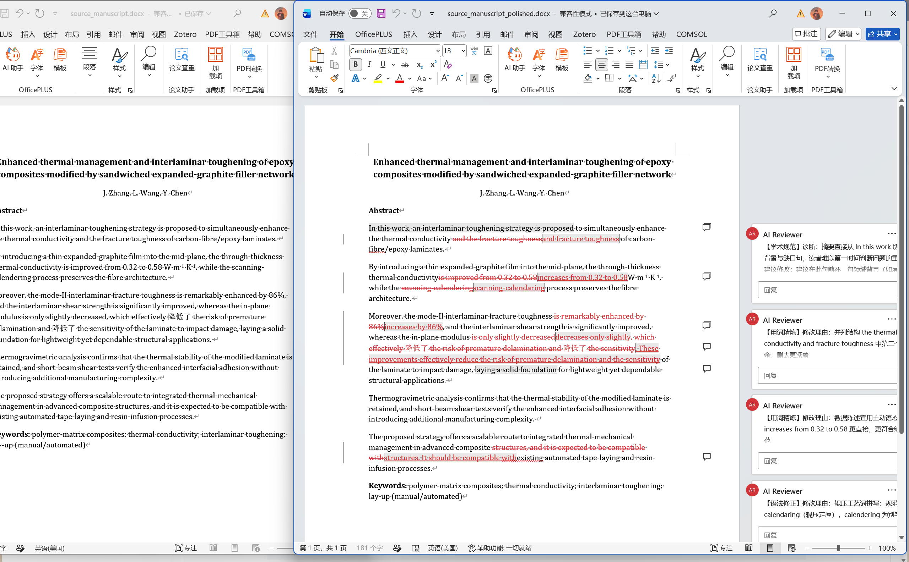

# docx-ai-review（AI 润色批注技能）

[English](./README.md) | **中文**

把 AI / 导师 / 润色意见应用到 Word 原稿：以 Word 原生批注和审阅模式呈现，正文与排版不破坏。

## 核心思路

- 以 **审阅模式修改** 为主：能明确前后对照的地方用红删绿插直观显示变化。
- 每条批注包含该处 **存在问题、句子中文翻译与修改意见**。
- 标注位置 **字符级准确**；前后文对比 **以句为单位**，句内用词级 diff。
- 原稿格式不破坏，由作者在 Word“审阅”视图逐条接受或拒绝。

## 功能

- 原生 Word 批注 + 字符级精确锚定。
- 保留格式的 Run 分裂：处理 Word 跨 Run 碎化文本，保留字体、加粗、斜体、颜色等。
- 审阅模式修订（`w:ins` / `w:del`），删除红色、插入绿色，并附修改理由批注。
- 自动校验 OOXML 结构完整性。
- 逐段 Markdown 意见稿细化：`markdown → polish_edits.json → 审阅修改`。
- 与论文润色技能联用：按结构化输出契约直接落改。

## 使用方式

### 1. 直接把意见稿转成批注 / 审阅修改

```bash
# 抽取正文
python scripts/ai_review_to_comments.py dump-text input.docx -o text.json

# 只加批注
python scripts/ai_review_to_comments.py apply input.docx reviews.json -o annotated.docx

# 审阅模式修改（有明确前后对照时）
python scripts/ai_review_to_comments.py tracked input.docx polish_edits.json -o revised.docx

# 整段改写按句修订
python scripts/ai_review_to_comments.py rewrite input.docx paragraph_rewrites.json -o revised.docx

# 校验批注/修订完整性
python scripts/ai_review_to_comments.py verify revised.docx
```

### 2. 细化逐段 Markdown 意见稿

```bash
python scripts/refine_review_markdown.py input.docx review.md -o polish_edits.json
python scripts/ai_review_to_comments.py tracked input.docx polish_edits.json -o revised.docx
```

细化器只保留“意见稿列出 + 当前原稿仍存在 + 有明确替换”的修改点，并跳过原稿已是上标的单位指数。

### 3. 与论文润色技能联用

先要求润色技能（如 `nature-polishing`、`academic-paper`）按 `references/polish_skill_contract.md` 输出结构化修改清单（逐句给出原文、修改后文本、理由与翻译），再直接落改：

```bash
python scripts/ai_review_to_comments.py convert input.docx polish_edits.json -o annotated.docx

润色结果直接落在 Word 原稿中，以审阅模式和批注呈现，无需开两个窗口人工一一对照。


```

## 安装

```bash
git clone https://github.com/pjy-20051012/docx-ai-review.git
# 把文件夹放入 skills 目录，例如 E:\下载\Codex\home\skills\
```

依赖：Python 3.10+、`python-docx>=1.2.0`、`lxml>=4.9.0`、`pydantic>=2.0.0`。

```bash
python -m pip install "python-docx>=1.2.0" "lxml>=4.9.0" "pydantic>=2.0.0"
```

## 仓库结构

```text
docx-ai-review/
├── SKILL.md                          # 技能入口
├── README.md                         # 英文说明
├── README.zh-CN.md                   # 中文说明
├── LICENSE
├── agents/openai.yaml                # 界面元数据
├── references/
│   ├── ooxml_notes.md                # OOXML 底层实现说明
│   ├── polish_skill_contract.md      # 润色技能输出契约
│   └── review_prompt_template.md     # 批注生成提示词
├── scripts/
│   ├── ai_review_to_comments.py      # 主程序
│   ├── refine_review_markdown.py     # 意见稿细化
│   └── test_ai_review.py             # 测试套件
└── examples/
    ├── demo_source.docx
    ├── demo_reviews.json
    ├── demo_polish_edits.json
    └── demo_annotated.docx
```

## 命令

| 命令 | 说明 |
|---|---|
| `dump-text input.docx [-o text.json]` | 抽取正文与段落索引 |
| `apply input.docx reviews.json -o out.docx` | 注入批注 |
| `convert input.docx polish_edits.json -o out.docx` | 把润色修改清单转为批注 |
| `tracked input.docx polish_edits.json -o out.docx` | 审阅模式修订并附批注理由 |
| `rewrite input.docx paragraph_rewrites.json -o out.docx` | 整段改写按句修订 |
| `verify annotated.docx` | 校验批注引用完整性 |

## 实战经验

- 所有锚点以当前原稿为准，意见稿常基于旧稿，原稿已修正的问题不要重复改。
- 先检查 `superscript`/`subscript` 格式，单位指数常已是上标，不要误改。
- 只应用“意见稿列出 + 原稿存在 + 有明确替换”的修改点。
- 每条修改配批注（问题、句子翻译、修改意见），同段相同批注去重。
- 逐句对照用词级 diff（字符级会拼坏单词），保留空格，保护上标单位，并验证接受态。
- 大段改写按句切分，不标记未变化文字。

## 测试

```bash
python scripts/test_ai_review.py
```

覆盖 Run 分裂、跨 Run 选区、中文字符、超链接锚点、重复短语、整段改写、审阅模式与联用流程。
